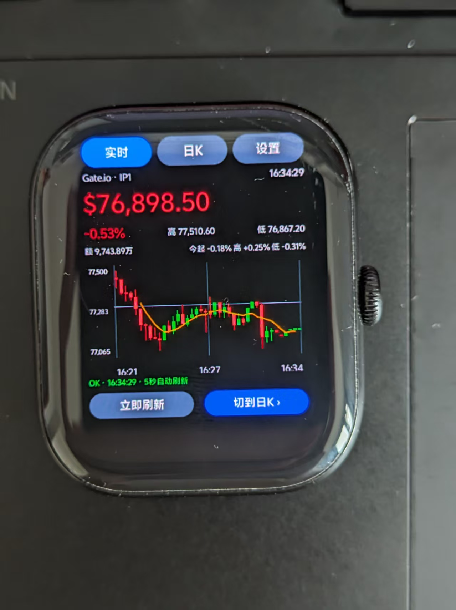
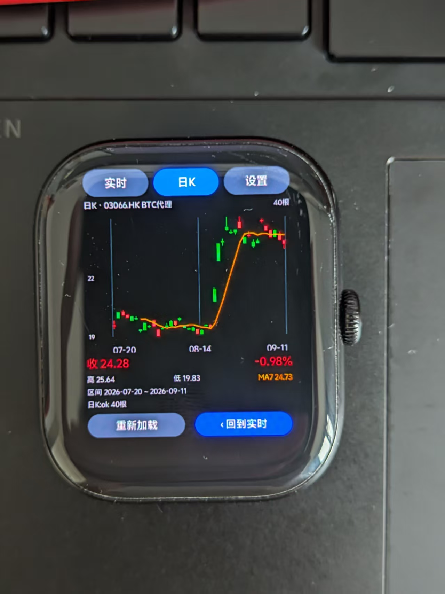
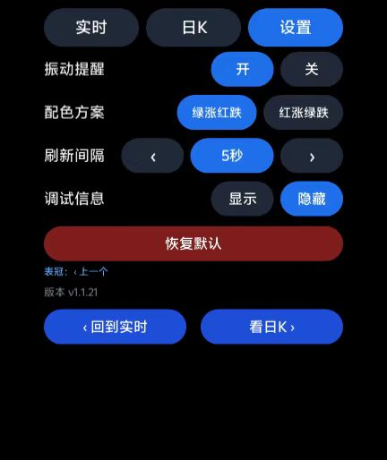

# BTC Watch — 比特币行情（vivo 蓝河手表版）

> 一款运行在 **vivo WATCH GT 2（eSIM 版）** 上的实时比特币行情查看工具
> 基于蓝河操作系统 3.0 / BlueOS Studio 从零构建



---

## ✨ 功能特性

| 功能 | 说明 |
|---|---|
| 📈 **实时行情** | 大字号价格显示，5 秒自动刷新，涨跌幅 / 最高 / 最低 / 成交额一屏可见 |
| 📊 **日K线图** | 40 根蜡烛满屏 + MA7 均线 + 价格刻度 + 时间刻度 |
| ⚙️ **个性化设置** | 振动提醒开关、配色方案（绿涨红跌 / 红涨绿跌）、刷新间隔调节 |
| 📳 **振动反馈** | 价格异动振动提醒，支持手动测试 |
| 🎛️ **表冠交互** | 旋转表冠切换视图，已做聚焦适配 |
| 🛡️ **容错机制** | 多数据源自动轮换 + 请求看门狗 + 指数退避重试 |

---

## 📸 界面截图

### 实时行情（主界面）


### 日K线



### 设置页



---

## 🖥️ 运行环境

| 项 | 值 |
|---|---|
| 设备 | vivo WATCH GT 2（eSIM 版） |
| 操作系统 | 蓝河操作系统 3.0（BlueOS 3.0） |
| 开发工具 | BlueOS Studio |
| 网络 | Wi-Fi 或 eSIM 独立联网 |
| 包格式 | .rpk（蓝河应用包，**不兼容 Android APK**） |

---

## 🔧 技术要点

### 开发范式

- 类 Web 技术栈：`.ux` 单文件组件 = `template` + `script` + `style` 三段式
- 生命周期与 Vue 类似，但**自定义方法不能写进 `methods` 对象**（会白屏）
- `script` 段为模块模式，所有工具函数需显式导出

### 联网策略（核心难点）

手表侧网络环境对境外域名存在 DNS 限制，为此做了以下处理：

| 问题 | 方案 |
|---|---|
| 境外域名 DNS 被污染 | **国内 DNS 解析 + IP 直连 + Host 头 + 明文 HTTP** 组合 |
| 请求头值不允许含 `://` | 自定义 Header 规避 |
| 避免 301/302 跳转 | 直接请求最终接口地址 |
| eSIM 首次握手慢（>4.5s） | 历史请求看门狗放宽至 12s |
| 单次请求过多导致限流 | **每轮请求数 ≤ 2**，多源轮换 |
| 启动时并发压力 | 启动错峰 1.5s + 成功即置位标志位 |
| 失败后反复重试 | 指数退避：5 → 10 → 20 → 40 → 60 秒 |

### 数据源

- **实时行情**：Gate.io 主源 + 备用源，自动故障切换
- **日K线**：通过持有比特币的港股代理标的（03066.HK）获取，可直连

### 代码结构（避坑提醒）

```
btcwatch/
├── manifest.json          # 应用配置（含 designWidth / 权限声明 / 图标）
├── app.ux                 # 应用入口
├── logo.png               # 应用图标（114×114，正方形无白边）
├── pages/
│   └── index/index.ux     # 主页面（template + script + style 三段）
└── dist/                  # 构建产物
```

> ⚠️ 项目路径**禁止中文和空格**，否则构建会报错。

---

## 🚀 安装方法

1. 使用 **BlueOS Studio** 打开工程目录
2. 连接手表（USB 调试模式）
3. 点击「运行」或「构建」生成 `.rpk` 包
4. 侧载安装到手表，首次启动即可看到实时行情

---

## 📜 开发历程

本应用从 V1 迭代到 V46，前后经历多轮真机调试：

| 阶段 | 关键里程碑 |
|---|---|
| V1 - V15 | 跑通基础逻辑，eSIM 下首次成功获取实时价格 |
| V16 - V30 | UI 重构，三标签架构（实时 / 日K / 设置）落地 |
| V31 - V41 | 多数据源轮换 + 容错机制，解决网络稳定性 |
| V42 | 修复无限重试问题（成功标志位缺失） |
| V43 - V44 | 修复代码结构导致的**白屏**（方法嵌套错误） |
| V45 | 引入万能探针页面，快速定位请求失败原因 |
| **V46** | **长超时 + 备用源，真机 eSIM 环境秒出数据，40 根蜡烛满屏** ✅ |

---

## ⚠️ 免责声明

- 本应用为**个人学习 / 技术交流**项目，行情数据仅供参考
- 数据来源于第三方公开接口，**不保证准确性与实时性**
- **不构成任何投资建议**，据此操作风险自负
- 与 vivo、BlueOS、Gate.io 等官方无任何关联

---

## 📄 开源协议

本项目仅供学习交流使用。

---

<p align="center">
  <b>⚡ Made with BlueOS Studio · 运行在 466 方屏上的小工具 ⚡</b>
</p>
